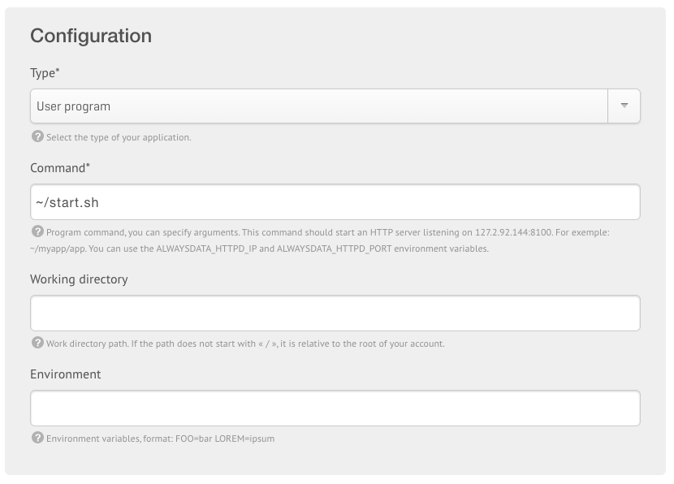
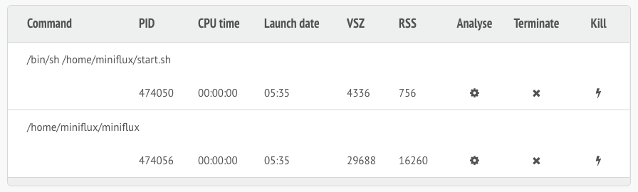

Installation Tutorials
======================

Deploying Miniflux on Heroku
----------------------------

Since the version 2.0.6, you can deploy Miniflux on `Heroku <https://www.heroku.com/>`_ in few seconds.

1. Clone the repository on your machine: ``git clone https://github.com/miniflux/miniflux.git``
2. Create a new Heroku application: ``heroku apps:create``
3. Add the Postgresql addon: ``heroku addons:create heroku-postgresql:hobby-dev``
4. Add environment variables to setup the application:

.. code::

    # This parameter will create all tables in the database.
    heroku config:set RUN_MIGRATIONS=1

    # The following parameters will create the first user.
    heroku config:set CREATE_ADMIN=1
    heroku config:set ADMIN_USERNAME=admin
    heroku config:set ADMIN_PASSWORD=test123

5. Deploy the application on Heroku: ``git push heroku master``
6. After the application is installed successfully, you don't need these variables anymore:

.. code::

    heroku config:unset CREATE_ADMIN
    heroku config:unset ADMIN_USERNAME
    heroku config:unset ADMIN_PASSWORD

- To watch the logs, use ``heroku logs``.
- You can also run a one-off container to run the commands manually: ``heroku run bash``.
  The Miniflux binary will be located into the folder ``bin``.
- To update Miniflux, pull the new version from the repository and push to Heroku again.

Deploying Miniflux on AlwaysData
--------------------------------

`AlwaysData <https://www.alwaysdata.com/>`_ is a French shared hosting provider.
You can install Miniflux in few minutes on their platform.

1. Open an account
2. Via the admin panel, create a Postgresql database and define a user/password
3. Create a website, choose "User Program", use a custom shell-script, for example ``~/start.sh``

4. Enable the SSH access and open a session `ssh account@ssh-account.alwaysdata.net`
5. Install Miniflux:

.. code:: bash

    wget https://github.com/miniflux/miniflux/releases/download/2.0.5/miniflux-linux-amd64
    mv miniflux-linux-amd64 miniflux
    chmod +x miniflux

6. Create a shell script to start miniflux, let's call it ``start.sh``:

.. code:: bash

    #!/bin/sh

    export LISTEN_ADDR=$ALWAYSDATA_HTTPD_IP:$ALWAYSDATA_HTTPD_PORT
    export DATABASE_URL="host=postgresql-xxxxx.alwaysdata.net dbname=xxxx user=xxxx password=xxx sslmode=disable"

    ~/miniflux

7. Make the script executable: ``chmod +x start.sh``
8. Run the db migrations and a create the first user:

.. code:: bash

    export DATABASE_URL=".... replace me...."
    ./miniflux -migrate
    ./miniflux -create-admin

9. Go to ``https://your-account.alwaysdata.net``

Via the admin panel, in Advanced > Processes, you can even see the Miniflux process running:

